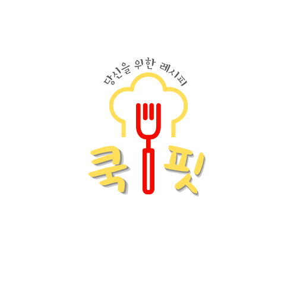

# 👩‍🍳당신을 위한 레시피, 쿡핏 : COOK FIT

## 프로젝트 소개

설명

## Runner Team3
<table>
    <tr>
        <th>박민서</th>
        <th>박인애</th>
        <th>유혜진</th>
        <th>이다빈</th>
        <th>홍연재</th>
    </tr>
    <tr>
        <th>BackEnd</th>
        <th>BackEnd</th>
        <th>FrontEnd</th>
        <th>DataAnalysis</th>
        <th>DataAnalysis</th>
    </tr>    
    <tr>
        <tb>로그인, 로그아웃, 이미지 검색</tb>
        <tb>레시피 생성 및 저장, 히스토리</tb>        
        <tb>프론트</tb>
        <tb>데분 & 백 연결</tb>
        <tb>추천 알고리즘</tb>
    <tr>
</table>

## Teck Stack
- 개발 기간 : 2024.12.21 ~ 2024.12.23

- stack

